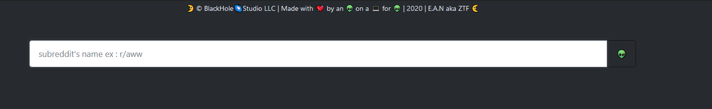
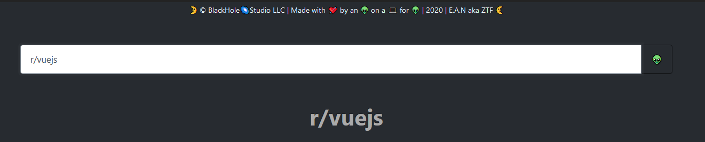
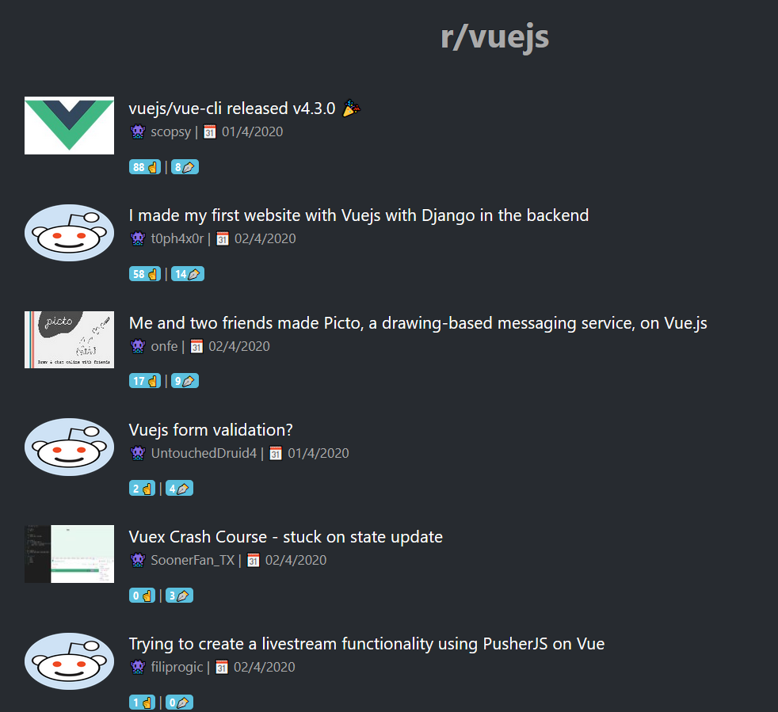

# redditapi

```
Another api training session , this time with vue & consuming the reddit api.

nothing special about this app .
```





## Project setup

```
pnpm install
```

### Compiles and hot-reloads for development

```
pnpm run serve
```

### Compiles and minifies for production

```
pnpm run build
```

### Lints and fixes files

```
pnpm run lint
```

### Customize configuration

```
you can always add filters , displays images , add a bunch of subs on the start .
```

```
🌛 &copy; BlackHole🌌Studio LLC | Made with 💘 by an 👽 on a 💻 for 👽 | 2020 | E.A.N aka ZTF 🌜
```
